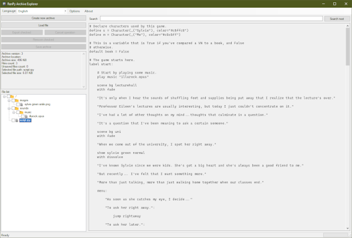
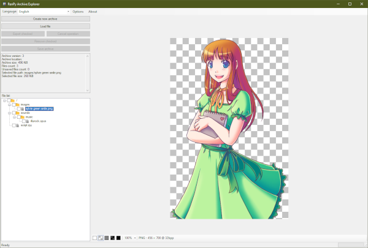
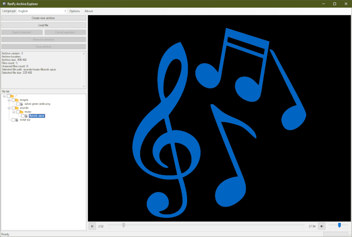

# RPA Explorer

Graphical explorer for RenPy Archives. This tool brings ability to extract,
create new or change existing RPA archives all in one window. It also provides
content preview for most common files in these packages. Initial parser code
was inspired by [RPATools](https://github.com/Shizmob/rpatool), so in case you
find this tool useful, go give them a thumbs up as well.
Now it even can try to preview compiled RenPy files (conditions apply[^1]).

> [!NOTE]
> This is a fan made application and there is no guarantee of further
development or fixes. External libraries are used for decompilation[^1] and
media playback[^2], which are downloaded at runtime and may take up a
surprising amount of space and processing power, are not the responsibility
of the authors, and may become unavailable at any time. Use at your own risk.

### Supported file types for preview:

- Text: py, rpy, txt, log, nfo, htm, html, xml, json, yaml, toml, csv
- Video[^2]: 3gp, flv, mov, mp4, ogv, swf, mpg, mpeg, avi, mkv, wmv, webm, [others](https://code.videolan.org/videolan/vlc/-/blob/master/include/vlc_interface.h)
- Audio[^2]: aac, ac3, flac, mp3, wma, wav, ogg, cpc, [others](https://code.videolan.org/videolan/vlc/-/blob/master/include/vlc_interface.h)
- Images: jpeg, jpg, bmp, tiff, png, webp, exif, ico, gif, webp[^3], avif[^3], heif[^3]
- Compilations[^1]: rpyc, rpymc

[^1]: To decompile Ren'Py script, you need a copy of [Python](https://www.python.org)
and a copy of [Unrpyc](https://github.com/CensoredUsername/unrpyc). The app
will download them for you if you don't have them.

[^2]: To play these file types, an embedded copy of the [VideoLAN Client](https://www.videolan.org)
is required. This isn't included in the standard RPA Explorer download and
will be downloaded on first use. Only available and tested on Windows.

[^3]: These file types aren't included in .NET and rely on third-party
libraries included with the main download. Only available and tested on
Windows.

### Known Issues:

- There's a bug in .NET's TreeView that can cause whether an item is checked
  or not to become out of sync with its appearance and children. Please take a
  moment between checking or unchecking things to avoid this issue.
- Some multimedia files don't include enough information for VLC to calculate
  positions or durations. This is a limitation of the file, not VLC.
- There's an issue in VLCSharp that causes it to repeatedly unload and reload
  VLC instead of reusing it between previews. Because of the large number of
  codecs included in VLC, this can cause the app to freeze if an unload
  coincidentally collides with a reload. More investigation is necessary, but
  in the meantime please take your time changing selections between media.

### Previews:

The software is provided "as is", without a warranty of any kind, express or
implied, including but not limited to the warranties of merchantability,
fitness for a particular purpose and non-infringement. In no event shall the
authors or copyright holders be liable for any claim, damages or other
liability, whether in an action of contract, tort or otherwise, arising from,
out of or in connection with the software or the use or other dealings
in the software.
